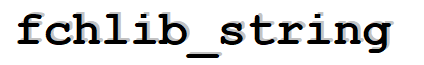

 
Bem vindo ao README da **fchlib_string**.  
 
# DESCRIÇÃO
 
A **fchlib_string** é uma biblioteca escrita em C que implementa algumas
funções bsicas para manipulação de strings. Ela é composta pelas seguintes funções:
 
- [**fchlib_str_character_distance**](#fchlib_str_character_distance)
- [**fchlib_str_contains**](#fchlib_str_contains)
- [**fchlib_str_count**](#fchlib_str_count)
- [**fchlib_str_equals**](#fchlib_str_equals)
- [**fchlib_str_find**](#fchlib_str_find)
- [**fchlib_str_to_lower**](#fchlib_str_to_lower)
- [**fchlib_str_to_upper**](#fchlib_str_to_upper)
- [**fchlib_str_remove**](#fchlib_str_remove)
- [**fchlib_str_repeat**](#fchlib_str_repeat)
- [**fchlib_str_replace**](#fchlib_str_replace)
- [**fchlib_str_reverse**](#fchlib_str_reverse)
- [**fchlib_str_split**](#fchlib_str_split)
- [**fchlib_str_array_delete**](#fchlib_str_array_delete)
  
# **<a name=fchlib_str_character_distance>fchlib_str_character_distance</a>**

Esta função retorna a distancia entre dois caracteres pertencentes a uma mesma string.

- ## prototipo da função :  
  
_size_t fchlib_str_character_distance(const char* start,const char* end);_
  
- ## parametros :
 start \( 'const char\*' \) : endereço do caractere inicial.
 end (const char*) : endereço do caractere final.

- ## retorno:
 distance (size_t) : retorna a distancia entre 2 caracteres em uma string.

- ## nota:
Caso 'start' ou 'end' não facam parte da mesma string essa função pode gerar comportamento inesperado.

# **<a name=fchlib_str_contains>fchlib_str_contains</a>**

Esta função verifica se uma string está contida dentro de outra.

- ## prototipo da função :
  
_bool fchlib_str_contains(const char* str,const char* search);_

- ## parametros :
 - str ('const char*') : string de origem.
 - search ('const char*') : string para ser verificada se pertence a 'str'.
 
- ## retorno:
 - ('bool'): retorna se 'search' pertence a 'str'.

# **<a name=fchlib_str_count>fchlib_str_count</a>**
Esta função retorna a quantidade de ocorrências de uma string em outra string.

- ## prototipo da função :  
   
_size_t fchlib_str_count(const char* str,const char* search);_
   
- ## parametros :
 - str ('const char*') : string de origem.
 - search ('const char*') : string a ser contada.
 
- ## retorno:
 - occurences (size_t) : retorna o número de ocorrencias de 'search' em 'str'.

# **<a name=fchlib_str_equals>fchlib_str_equals</a>**
Esta função verifica se duas strings são iguais.

- ## prototipo da função :  
   
_int fchlib_str_equals(const char* s1,const char* s2,bool ignore_case);_

- ## parametros :
  - s1 ('const char*') : primeira string.
  - s2 ('const char*') : segunda string.
  - ignore_case ('bool'): flag para ignorar o caso.

- ## retorno:
  - (int) : -1 se 's1' é menor que 's2'. 0 se forem iguais e 1 se 's1' for maior que 's2'.

# **<a name=fchlib_str_find>fchlib_str_find</a>**
Esta função realiza a busca por uma string.

- ## prototipo da função :  
  
_int fchlib_str_find(const char* str,const char* search);_

- ## parametros :
  - str ('const char*') : string de origem.
  - search ('const char*') : string a ser buscada.

- ## retorno:
  - ('int') : retorna o index da primeira ocorrencia da string 'search' ou -1 caso não seja encontrada.

# **<a name=fchlib_str_to_lower>fchlib_str_to_lower</a>**
Esta função converte uma string para minusculas.

- ## prototipo da função :  
  
_char* fchlib_str_to_lower(char* str);_

- ## parametros :
  - str ('char*') : string à ser convertida.

- ## retorno:
  - ('char*') : retorna a mesma string convertida para minusculas.

# **<a name=fchlib_str_to_upper>fchlib_str_to_upper</a>**
Esta função converte uma string para maiusculas.

- ## prototipo da função :  

_char* fchlib_str_to_upper(char* str);_

- ## parametros :
  - str ('char*') : string à ser convertida.

- ## retorno:
  - ('char*') : retorna a mesma string convertida para maiusculas.

# **<a name=fchlib_str_remove>fchlib_str_remove</a>**
Esta função remove uma substring de uma string.

- ## prototipo da função :  
   
_char* fchlib_str_remove(char* str,const char* str_rm,size_t maxremove);_

- ## parametros :
  - str ('char*') : string de origem.
  - str_rm ('const char*') : string a ser removida.
  - maxremove ('size_t') : quantidade de remoções. use 0 para remover todas as ocorrencias de 'str_rm'.

- ## retorno:
  - ('char') : retorna a mesma string com a 'str_rm' removida.

# **<a name=fchlib_str_repeat>fchlib_str_repeat</a>**
Esta função repete uma string.

- ## prototipo da função :  

_char* fchlib_str_repeat(char* str,int maxrepeat);_

- ## parametros :
  - str ('char*') : string a ser repetida.
  - maxrepeat (size_t) : quantidade de repetições de 'str'.

- ## retorno:
  - ('char*') : retorna a mesma string repetida.

- ## nota:
  'str' deve possuir espaço suficiente para todas as repetições, caso contrario pode apresentar comportamento inesperado.

# **<a name=fchlib_str_replace>fchlib_str_replace</a>**
Esta função que realiza a substituição de uma substring por outra.

- ## prototipo da função :  

_char* fchlib_str_replace(char* str,const char* str_rm,const char* str_new,size_t maxreplace);_

- ## parametros :
  - str ('char*') : string de origem.
  - str_rm ('const char*') : string a ser substituida.
  - str_new ('const char*') : nova string no lugar de 'str_rm'.
  - maxreplace (size_t) : quantidade de substituições em 'str'. use 0 para realizar todas as substituições possiveis.

- ## retorno:
  - ('char*') : retorna a mesma string com as substituções.

- ## nota:
  'str' deve possuir espaço suficiente para todas as substituições, caso contrario pode apresentar comportamento inesperado.

# **<a name=fchlib_str_reverse>fchlib_str_reverse</a>**
Esta função inverte uma string.

- ## prototipo da função :  

_char* fchlib_str_reverse(char* str);_

- ## parametros :
  - str ('char*') : string à ser invertida.

- ## retorno:
  - ('char*') : retorna a mesma string invertida.

# **<a name=fchlib_str_split>fchlib_str_split</a>**
Esta função quebra um string em partes.

- ## prototipo da função :  
   
_StringArray* fchlib_str_split(char* str,const char* sep,size_t maxsplit);_

- ## parametros :
  - str ('char*') : string de origem.
  - sep ('char*') : string de separação.
  - maxsplit ('size_t') : quantidade maxima de quebras. use 0 para realizar todas as quebras possiveis.

- ## retorno:
  - ('StringArray*') : retorna um 'StringArray*' contendo todas as quebras.

# **<a name=fchlib_str_array_delete>fchlib_str_array_delete</a>**
Esta função libera a memoria alocado por um 'StringArray*'.

- ## prototipo da função :  

   
_StringArray* fchlib_str_array_delete(StringArray* str_array);_

- ## parametros :
  - str_array ('StringArray*') : string array a ser liberado.

- ## retorno:
  - (StringArray*) : retorna 'NULL'.