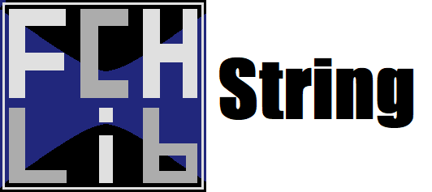

<p align="center">
    
</p>

<p align="center">
  Welcome to the <b>README</b> of the <b>fchlib_string</b> library.
</p>
 
# Description  

**fchlib_string** is a library written in C that implements some basic functions for manipulating strings. It consists of the following functions:

# <a name=index>Table of contents</a>
 
- [**string_contains**](#string_contains)
- [**string_count**](#string_count)
- [**string_ends_with**](#string_ends_with)
- [**string_equals**](#string_equals)
- [**string_find**](#string_find)
- [**string_free**](#string_free)
- [**string_join**](#string_join)
- [**string_remove**](#string_remove)
- [**string_repeat**](#string_repeat)
- [**string_replace**](#string_replace)
- [**string_reverse**](#string_reverse)
- [**string_split**](#string_split)
- [**string_start_with**](#string_start_with)
- [**string_to_lower**](#string_to_lower)
- [**string_to_upper**](#string_to_upper)
- [**string_array_delete**](#string_array_delete)
- [**Versions**](#version)

# **<a name=string_contains>string_contains</a>**  <h6>[back to indice](#index)</h6>

This function checks whether one string is contained in another.

- ## function prototype :

```c  
bool string_contains(const char* str, const char* search);
```
- ## parameters:
  - str `(const char*)`: source string.
  - search `(const char*)`: string to be checked if it belongs to **str**.
  
- ## return:
  - `(bool)`: returns `true` if **search** is a substring of **str**.

- ## example of use
```c  
const char str[] = "first string example";
const char search[] = "string";
bool contains = string_contains(str, search);/*return true*/
```
```c  
const char str[] = "first string example";
const char search[] = "two";
bool contains = string_contains(str, search);/*return false*/
```

# **<a name=string_count>string_count</a>**  <h6>[back to indice](#index)</h6>
This function returns the number of occurrences of a string in another string.

- ## function prototype :  

```c
size_t string_count(const char* str, const char* search);
```
   
- ## parameters:
   - str `(const char*)`: source string.
   - search `(const char*)`: string to be counted.
 
- ## return:
   - occurences `(size_t)`: returns the number of occurrences of **search** in **str**.
- ## example of use:
```c
const char str[] = "first string example";
const char search[] = " ";
size_t count = string_count(str, search);/*return 2*/
```
```c
const char str[] = "first string example";
const char search[] = "two";
size_t count = string_count(str, search);/*return 0*/
```
# **<a name=string_ends_with>string_ends_with</a>**  <h6>[back to indice](#index)</h6>

This function checks whether a string ends with a given string.

- ## function prototype :  
  
```c
bool string_ends_with(const char* str, const char* end);
```

- ## parameters:
  - str `(const char*)`: source string.
  - end `(const char*)`: string to be checked at the end of **str**.

- ## return:
  - `(bool)`: returns if **str** ends with **end**.
- ## example of use:
```c
const char str[] = "first string example";
const char search[] = "ple";
bool is_end = string_ends_with(str, search);/*return true*/
```
```c
const char str[] = "first string example";
const char search[] = "string";
bool is_end = string_ends_with(str, search);/*return false*/
```
# **<a name=string_equals>string_equals</a>**  <h6>[back to indice](#index)</h6>
This function checks whether two strings are the same.

- ## function prototype :  
   
```c
int string_equals(const char* s1, const char* s2, bool ignore_case);
```
- ## parameters:
  - s1 `(const char*)`: first string.
  - s2 `(const char*)`: second string.
  - ignore_case `(bool)`: flag to ignore the case.

- ## Returns:
  - `(int)`: -1 if **s1** is less than **s2**. 0 if they are equal and 1 if **s1** is greater than **s2**. Case **s1** or **s2** are `NULL`, this function returns -2. If no internal allocation is possible, this function returns -3
- ## example of use:
```c
bool ignore = true;
const char s1[] = "string";
const char s2[] = "String";
bool equals = string_equals(s1, s2, ignore_case);/*return true*/
```
```c
bool ignore = false;
const char s1[] = "string";
const char s2[] = "String";
bool equals = string_equals(s1, s2, ignore_case);/*return false*/
```

# **<a name=string_find>string_find</a>**  <h6>[back to indice](#index)</h6>
This function performs the search for a string.

- ## function prototype :  
  
```c
int string_find(const char* str, const char* search);
```

- ## parameters:
  - str `(const char*)`: source string.
  - search `(const char*)`: string to be searched.

- ## return:
  - `(int)`: returns the index of the first occurrence of the string **search** or -1 if not found.

- ## example of use:
```c
const char str[] = "first string example";
const char search[] = "string";
int index = string_find(str, search);/*return 5*/
```
```c
const char str[] = "first string example";
const char search[] = "hello";
int index = string_find(str, search);/*return -1*/
```

# **<a name=string_free>string_free</a>**  <h6>[back to indice](#index)</h6>
this function frees the memory allocated by a string.

- ## function prototype :  
  
```c
char* string_free(char* str);
```
- ## parameters:
  - str `(const char*)`: string to be released.

- ## return:
  - `(NULL)`: release **str** if it is not `NULL` and return` NULL`.

- ## example of use:
```c
str = string_free(str);
```

# **<a name=string_join>string_join</a>**  <h6>[back to indice](#index)</h6>
This function converts a `StringArray` to a string.

- ## function prototype :  
   
```c
char* string_join(StringArray str_array, char* separator);
```

- ## parameters:
  - str_array `(StringArray)`: source `StringArray`.
  - separator `(const char *)`: string used to separate the string resulting from the concatenation.

- ## return:
  - `(char*)`: returns a new string allocated with the result of the concatenation or `NULL` if a new string cannot be allocated.

- ## example of use:
```c
const char str[] = "first string example";
StringArray split = string_split(str, " ", 0);
char* result = string_join(split, " ");/*return "first string example"*/
```

# **<a name=string_remove>string_remove</a>**  <h6>[back to indice](#index)</h6>
This function removes a substring from a string.

- ## function prototype :  
   
```c
char* string_remove(char* str, const char* str_rm, size_t maxremove);
```

- ## parameters:
  - str `(char*)`: source string.
  - str_rm `(const char*)`: string to be removed.
  - maxremove `(size_t)`: number of removals. use 0 to remove all occurrences of **str_rm**.

- ## returns:
  - `(char)`: returns a new string allocated with **str_rm** removed or returns `NULL` if one of the variables **str** and **str_rm** is` NULL` or if a new string cannot be allocated.

- ## example of use:
```c
const char str[] = "first string";
const char str_rm[] = " string";
char* new_string = string_remove(str, str_rm, 0);/*return "first"*/
```

# **<a name=string_repeat>string_repeat</a>**  <h6>[back to indice](#index)</h6>
This function repeats a string.

- ## function prototype :  

```c
char* string_repeat(char* str, size_t maxrepeat);
```
- ## parameters:
  - str `(char*)`: string to be repeated.
  - maxrepeat `(size_t)`: number of repetitions of **str**.

- ## return:
  - `(char*)`: returns to a new string allocated with **str** repeated.

- ## example of use:
```c
const char str[] = "banana ";
char* new_string = string_repeate(str, 3);/*return "banana banana banana "*/
```

# **<a name=string_replace>string_replace</a>**  <h6>[back to indice](#index)</h6>
This function performs the substitution of one substring for another.

- ## function prototype :  

```c
char* string_replace(char* str, const char* str_rpl, const char* str_new, size_t maxreplace);
```
- ## parameters:
  - str `(char*)`: source string.
  - str_rpl `(const char*)`: string to be replaced.
  - str_new `(const char*)`: new string in place of **str_rm**.
  - maxreplace `(size_t)`: number of substitutions in **str**. use 0 to make all possible substitutions.

- ## Returns:
  - `(char*)`: returns a new string allocated with the substitutions. If one of the variables **str**, **str_rm** and **str_new** is `NULL` this function returns `NULL`.

- ## example of use:
```c
const char str[] = "first string example";
char* result = string_replace(str, " ", "-", 0);/*return "first-string-example"*/
```
```c
const char str[] = "first string example";
char* result = string_replace(str, "string", "", 0);/*return "first  example"*/
```
# **<a name=string_reverse>string_reverse</a>**  <h6>[back to indice](#index)</h6>
This function inverts a string.

- ## function prototype :  

```c
char* string_reverse(char* str);
```

- ## parameters:
  - str `(char*)`: string to be inverted.

- ## returns:
  - `(char*)`: returns the same inverted string.

- ## example of use:
```c
char str[] = "example";
string_reverse(str);
printf(str);/*print "elpmaxe"*/
```

# **<a name=string_split>string_split</a>**  <h6>[back to indice](#index)</h6>
This function divides a string into parts.

- ## function prototype :  
   
```c
StringArray string_split(char* str, const char* sep, size_t maxsplit);
```

- ## parameters:
  - str `(char*)`: source string.
  - sep `(const char*)`: separation string.
  - maxsplit `(size_t)`: maximum number of divisions. use 0 to make all possible divisions.

- ## returns:
  - `(StringArray)`: returns a **StringArray** containing all divisions.
- ## note:
  If **str** or **sep** are `NULL`, empty string or it is not possible to allocate space for StringArray and its data, this function returns `NULL`.

- ## example of use:
```c
size_t index = 0;
const char str[] = "first string example";
StringArray split = string_split(str, " ", 0);

for(index=0; index < split->_size; ++index){/*iterating the StringArray*/
  printf(split->string[i]); /*print "first", "string", "example"*/
}
```

# **<a name=string_start_with>string_start_with</a>**  <h6>[back to indice](#index)</h6>

This function checks whether a string starts with a given string.

- ## function prototype :  
  
```c
bool string_start_with(const char* str, const char* start);
```
  
- ## parameters:
  - str `(const char*)`: source string.
  - start `(const char*)`: string to be checked at the beginning of **str**.

- ## return:
  - `(bool)`: returns `true` if **str** starts with **start**.

- ## example of use:
```c
const char str[] = "first string example";
const char start[] = "first";
bool is_start = string_start_with(str, start);/*return true*/
```
```c
const char str[] = "first string example";
const char start[] = "hello";
bool is_start = string_start_with(str, start);/*return false*/
```

# **<a name=string_to_lower>string_to_lower</a>**  <h6>[back to indice](#index)</h6>
This function converts a string to lowercase.

- ## function prototype :  
  
```c
char* string_to_lower(char* str);
```

- ## parameters:
  - str `(char*)`: string to be converted.

- ## return:
  - `(char*)`: returns the same string converted to lowercase.

- ## example of use:
```c
char str[] = "EXAMPLE";
string_to_lower(str);
printf(str);/*print "example"*/
```

# **<a name=string_to_upper>string_to_upper</a>**  <h6>[back to indice](#index)</h6>
This function converts a string to uppercase.

- ## function prototype :  

```c
char* string_to_upper(char* str);
```

- ## parameters:
  - str `(char*)`: string to be converted.

- ## returns:
  - `(char*)`: returns the same string converted to uppercase.

- ## example of use:
```c
char str[] = "example";
string_to_upper(str);
printf(str);/*print "EXAMPLE"*/
```

# **<a name=string_array_delete>string_array_delete</a>**  <h6>[back to indice](#index)</h6>
This function frees the memory allocated by a **StringArray**.

- ## function prototype :  
   
```c
StringArray string_array_delete(StringArray str_array);
```

- ## parameters:
  - str_array `(StringArray)`: string array to be released.

- ## return:
  - `(StringArray)`: returns ** `NULL` **.

- ## example of use:
```c
str_array = string_array_delete(str_array);
```
---
# **<a name=version>Version</a>**  <h6>[back to indice](#index)</h6>

- current version:
  <h5><b>1.0.11032021</b></h5>

- previous versions:
  ~~<h5>1.0.08112020<h5>~~
---
<p align="center">
    Copyright © 2021 <b>FranciscoCharles</b>
</p>